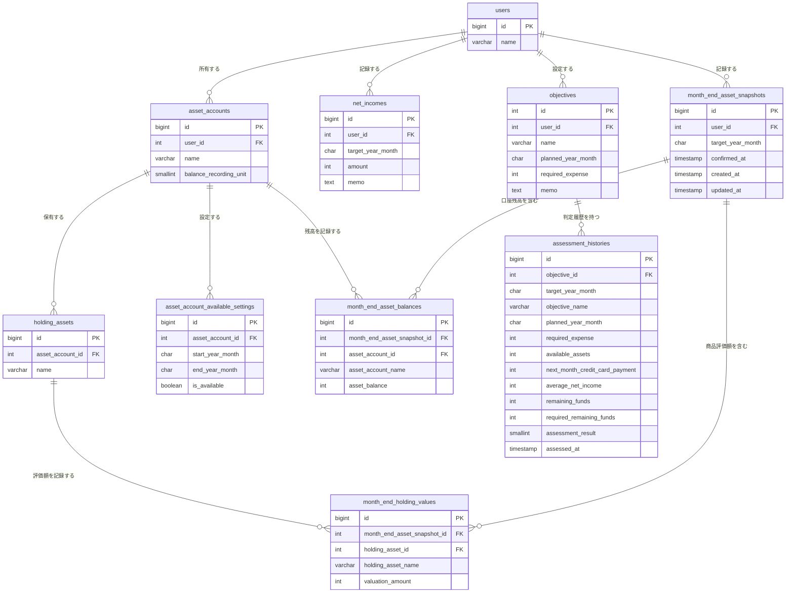

# ER図

## Phase1

## 補足

- Users は AssetAccount（資産口座）  を複数所有できる
- Users は NetIncome（手取り収入） を複数所有できる
- Users は Objective(目的)  を複数所有できる
- Users は TargetYearMonth（対象年月） の MonthEndAssetSnapshot(月末資産状況) を記録できる
- AssetAccount（資産口座）は、複数のHoldingAsset（保有商品）を保有できる
- AssetAccount（資産口座）は、適用期間ごとに利用可能資産へ含めるかどうかの設定を持つ
- MonthEndAssetSnapshot（月末資産状況）は、複数のMonthEndAssetBalance（月末資産残高）を含む
- MonthEndAssetSnapshot（月末資産状況）は、複数のMonthEndHoldingValue（商品別月末評価額）を含む
- MonthEndAssetSnapshot（月末資産状況）の状態はconfirmed_atで表現する
  - confirmed_atがNULLの場合は未確定
  - confirmed_atがNULL以外の場合は確定済み
  - 確定後に残高情報を変更した場合はconfirmed_atをNULLに戻す
- MonthEndAssetBalance（月末資産残高）は、AssetAccount（資産口座）ごとの月末残高を記録する
- MonthEndHoldingValue（商品別月末評価額）は、HoldingAsset（保有商品） ごとの月末評価額を記録する
- Objective(目的) は判定時点のAssessmentHistory（判定履歴） を持つことができる
